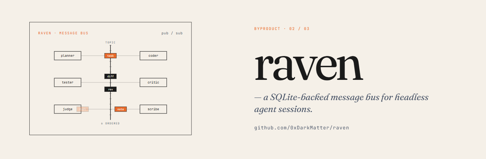

**Built for the Claude Opus 4.7 Hackathon.**

[](https://opensource.org/licenses/MIT)
[](https://www.python.org/downloads/)
[](#status)
[](https://www.anthropic.com/)
[](https://github.com/astral-sh/ruff)

> *A SQLite-backed, role-addressable message bus for live coordination between agent sessions.*

**raven** is the messaging primitive that lets agents in the same swarm coordinate while they're running. One process publishes a `plan`, another subscribes as `architect:swarm-1`, a third rolls in as `verifier:swarm-1` — all sharing a single SQLite file with WAL mode, no broker, no daemon, no Redis. It's the lower-level reusable substrate extracted from [Axiom](https://github.com/0xDarkMatter/axiom) (internal codename: *Raven*).

Where [Pigeon](https://github.com/0xDarkMatter/pigeon) is **email** — async notes you leave for a project that may not boot for hours — raven is **Slack**: live, in-swarm, sub-second, role-addressable. Both ship together because both shapes are needed for serious agent systems.

**10 CLI commands. 5 worked examples. Optional HTTP bridge. One SQLite file. Zero infrastructure.**


## Recent Updates

**v0.1.1** (April 2026)

*   🐛 **Identity hygiene** - `read` / `ack` and `GET /message/{id}` no longer add spurious `__cli__` / `__http__` / `reader` rows to the `aliases` table on every invocation. `BusClient("", "alice")` and `BusClient("s", "bad:role")` now fail fast with a clear `ValueError`.
*   🛡️ **Stricter HTTP validation** - `GET /inbox` returns 400 on `role=a:` (empty session), `role=:b` (empty role), and `max<1` — previously these silently returned an empty array, masking caller bugs.
*   ⚡ **Cached `init_db()`** - Long-running subscribers and bulk CLI usage no longer re-execute the migration script on every `BusClient()` instantiation. Pass `force=True` to bypass.
*   🔧 **Cleaner CLI errors** - `cli_main()` renders `ClaudeBusError`, missing-message, missing-file, and permission-denied exceptions as one-line `error: ...` messages with proper exit codes — no Python tracebacks for users.
*   🆕 **Quality-of-life additions** - `raven version` subcommand, short flags (`inbox -r/-m/-j`, `send -t`, `read -j`), `doctor` checks the bundled `0001_initial.sql` migration is present, and `_core.read_by_id()` identity-free fetch primitive.
*   🔭 **`raven tail`** - Live stream observer: watches all bus traffic (or one role's messages) without consuming them. Identity-free, never competes with subscribers, pipe-friendly `--json` mode.
*   ✅ **Integration tests** - Full subprocess integration tests for the news-desk and server-incident pipelines; 100% line coverage across all 179 tests.

**v0.1.0** (April 2026)

*   🚀 **Initial release** - Phase-1 ship of the role-addressable message bus extracted from Axiom. Core `BusClient` API with `send`/`inbox`/`ack`/`subscribe`, 8-command CLI (`init`, `doctor`, `session init`, `send`, `inbox`, `read`, `ack`, `serve`), optional Starlette HTTP bridge with read endpoints, pluggable Pydantic schema registry, and a single-file SQLite store with WAL mode for multi-producer/multi-consumer use. Five worked examples included, from single-process round-trips to a 5-agent SRE incident-response pipeline.

[View full changelog →](https://github.com/0xDarkMatter/raven/commits/main)

## Mailbox vs bus — where raven fits

| | [Pigeon](https://github.com/0xDarkMatter/pigeon) (mailbox) | **raven** (bus) |
|---|---|---|
| Concurrency | Async, eventually consistent | Live, session-active |
| Recipient state | Probably **not running** when you write | **Running and waiting** for messages |
| Latency tolerated | Minutes to days | Sub-second to seconds |
| Mental model | Email / inbox | Slack / message bus |
| Address scheme | Per-project hash (one mailbox per repo) | `<role>:<session>` (many mailboxes per swarm) |
| Use cases | Handoff between waves, notes-to-self | Live role-to-role coordination during a swarm run |
| Shape | Go CLI binary | Python in-process + optional HTTP bridge |

**Use Pigeon** when one session needs to leave a note for another project, possibly across days.
**Use raven** when agent roles in the same swarm need to coordinate while running.

## Why raven?

Multi-agent systems hit a coordination wall fast. The naïve options all break:

- **Shared files** — Race conditions, no fanout, no `ack`, no addressing. Works for one writer; explodes at three.
- **Redis / RabbitMQ / NATS** — Real broker = real ops. You're now running a daemon, exposing a port, managing auth, and shipping a Docker container with your hackathon project.
- **HTTP between processes** — Every consumer needs its own server, no persistence on crash, no inbox semantics, and now you're writing routing yourself.
- **Anthropic's tool-call channel** — Works inside one session. Useless across sessions, processes, or hosts.

raven picks the smallest shape that actually solves the problem: **one SQLite file in WAL mode**, addressed by `<role>:<session>`, with `send` / `inbox` / `ack` / `subscribe` semantics and an optional HTTP bridge for non-Python consumers. No broker, no daemon, no port — just a file path that any process on the host can open.

## Key Benefits

- **Zero infrastructure** — Single SQLite file. No broker, no daemon, no port, no auth surface
- **Role-addressable** — `<role>:<session>` lets you fan in/out by role across many swarms in the same DB
- **At-most-once delivery** — Atomic `UPDATE … WHERE status IN ('sent','delivered')` claim; subscribers never see duplicates
- **Polyglot via HTTP** — Optional Starlette bridge for Docker agents and non-Python consumers
- **Schema-flexible** — Pydantic model registry per message type; permissive by default, strict on opt-in
- **Crash-safe** — Messages persist in SQLite. Restart a subscriber and it picks up where it left off
- **Cross-process** — WAL mode lets multiple producers and consumers share the file with no coordinator
- **Production heritage** — Extracted from Axiom (Raven), where it powers a multi-lane agent orchestrator

## Structure

```
raven/
├── src/claude_bus/
│   ├── _core.py          # low-level send / list / claim / resolve primitives
│   ├── client.py         # BusClient — high-level public API + subscribe()
│   ├── aliases.py        # role:session ↔ deterministic alias registry
│   ├── db.py             # init_db, WAL setup, busy timeout
│   ├── schemas.py        # SchemaRegistry, Pydantic body validation
│   ├── session.py        # register_role_alias helper
│   ├── exceptions.py     # ClaudeBusError hierarchy
│   ├── http.py           # Starlette bridge (optional [http] extra)
│   ├── cli/              # Typer CLI (10 commands)
│   └── migrations/       # 0001_initial.sql
├── examples/
│   ├── 01-hello-world/        # single-process round-trip
│   ├── 02-two-processes/      # cross-process coordination
│   ├── 03-news-desk/          # 5 agents, fan-out + fan-in editorial
│   └── 04-server-incident/    # 5 SRE agents diagnose flaky server
├── tests/                # pytest, pytest-asyncio, 179 tests (100% line coverage)
├── CHANGELOG.md
└── pyproject.toml
```

## Installation

```bash
pip install raven              # core
pip install 'raven[http]'      # + optional HTTP bridge (Starlette + uvicorn)
pip install 'raven[dev]'       # + pytest, pytest-asyncio, httpx, coverage
```

Requires **Python 3.12+**.

## Quickstart

### Five lines of Python

```python
from claude_bus import BusClient

a = BusClient(session_id="swarm-1", role="conductor", db_path="bus.db")
b = BusClient(session_id="swarm-1", role="architect", db_path="bus.db")

a.send(to=b.address, type="plan", body={"step": 1, "goal": "design auth"})

for msg in b.inbox():
    print(msg.body)        # {'step': 1, 'goal': 'design auth'}
    b.ack(msg.id)
```

### CLI quickstart

```bash
$ raven init
wrote raven.yaml
initialised .../raven.db
ready. try: raven doctor

$ raven send --from conductor:swarm-1 --to architect:swarm-1 \
    --type plan --body '{"step": 1}'
sent #1 conductor:swarm-1 -> architect:swarm-1 type=plan

$ raven inbox --role architect:swarm-1 --json
{
  "messages": [
    {"id": 1, "sender": "conductor:swarm-1", "body": {"step": 1}, ...}
  ]
}

$ raven ack 1
acked #1
```

## What's Included

### CLI Commands

| Command | Purpose |
|---|---|
| `init` | Write `raven.yaml` + initialise the SQLite DB at the configured path |
| `doctor` | Health check — DB writable, migration present, schema valid |
| `session init` | Pre-register a `<role>:<session>` identity without sending |
| `send` | Publish a message: `--from`, `--to`, `-t/--type`, `--body` (JSON) |
| `inbox` | List pending messages for a role: `-r/--role`, `-m/--max`, `-j/--json` |
| `read` | Fetch a single message by id without acking it: `-j/--json` |
| `ack` | Mark a message as read (idempotent) |
| `tail` | Stream all bus traffic live — identity-free observer, never consumes messages |
| `serve` | Start the optional Starlette HTTP bridge on `127.0.0.1:7713` |
| `version` | Print the installed raven version |

### Worked examples

| Example | Shape | What it demonstrates |
|---|---|---|
| `01-hello-world/` | 1 process | Round-trip `send` → `inbox` → `ack` in a single script |
| `02-two-processes/` | 2 processes | Cross-process coordination via the shared SQLite file |
| `03-news-desk/` | 5 agents | Fan-out + fan-in editorial pipeline (assignment → drafts → edit → publish) |
| `04-server-incident/` | 5 SRE agents | Diagnose & remediate a flaky server cooperatively |

## Async subscribe

```python
import asyncio
from claude_bus import BusClient

async def consume():
    b = BusClient(session_id="swarm-1", role="architect", db_path="bus.db")
    async for msg in b.subscribe(poll_interval_s=0.5):
        print(f"#{msg.id} {msg.type}: {msg.body}")
        # message is acked before yield (at-most-once)

asyncio.run(consume())
```

`subscribe()` claims messages atomically via `UPDATE … WHERE status IN ('sent','delivered')`. Two subscribers on the same role will not see the same message — the loser's update affects zero rows and the message is yielded exactly once.

## Live bus observer — `tail`

`raven tail` is a read-only observer that streams every message through the bus without consuming any of them. It's useful for debugging pipelines and watching live swarm traffic:

```bash
$ raven tail                          # all traffic, follow mode
$ raven tail --role architect:swarm-1 # filter to one recipient
$ raven tail --no-follow              # print backlog and exit
$ raven tail --json                   # newline-delimited JSON (pipe-friendly)
$ raven tail --from 42                # resume from a known message id
```

Multiple tailers can run in parallel alongside active subscribers — `tail` never touches message status and never competes with consumers.

## Pluggable schemas

By default any JSON body is accepted. Register a Pydantic model to start enforcing a shape per message type:

```python
from pydantic import BaseModel
from claude_bus import SchemaRegistry

class PlanBody(BaseModel):
    step: int
    goal: str

SchemaRegistry.register("plan", PlanBody)

# Now send(type="plan", body=...) validates against PlanBody.
# SchemaRegistry.strict_mode(True) rejects unregistered types entirely.
```

Validation failures raise `SchemaValidationError`. Strict mode (off by default) refuses any `type` that isn't in the registry — useful for sealed swarms where every message shape is known up-front.

## HTTP bridge (optional)

The `[http]` extra ships a small Starlette app for non-Python consumers (e.g. an agent inside a Docker container that can't share the host's filesystem):

```bash
$ pip install 'raven[http]'
$ raven serve --port 7713 &

$ curl http://127.0.0.1:7713/health
{"status": "ok", "db": "...", "version": "0.1.1"}

$ curl 'http://127.0.0.1:7713/inbox?role=architect:swarm-1'
{"messages": [...]}

$ curl http://127.0.0.1:7713/message/1
{"id": 1, "sender": "...", "body": {...}}
```

Phase 1 ships **read endpoints only** (`GET /health`, `GET /inbox`, `GET /message/{id}`). The write path stays on the CLI / Python API in v0.1.x. `POST /send` and `POST /ack` are planned for **v0.2.0**.

The bridge binds to `127.0.0.1` by default — there is no built-in auth. For multi-host or untrusted-network deployments, terminate TLS + auth at a reverse proxy in front of `raven serve`.

## Architecture

A single SQLite file holds an `aliases` table (deterministic identities per `(role, session)`) and a `messages` table (append-only, indexed for inbox reads). `BusClient` is a thin layer that auto-registers the sender + recipient identities and wraps `send` / `inbox` / `ack` calls. WAL mode lets multiple producers and consumers share the file with no broker process. The optional HTTP bridge is a Starlette app that exposes the same reads over loopback HTTP for consumers that can't share the filesystem.

```
┌──────────┐  send/inbox/ack  ┌────────────────┐
│ producer │ ────────────────►│  SQLite store  │◄─── HTTP bridge ──── docker agent
│  Python  │                  │  (WAL, single  │     (optional)        (curl etc.)
└──────────┘                  │   shared file) │
                              └────────────────┘
                                        ▲
                              consumer  │ subscribe / inbox / ack
                                        │
                                  ┌──────────┐
                                  │ consumer │
                                  │  Python  │
                                  └──────────┘
```

### Address scheme

Every message is addressed by `<role>:<session>` — for example `architect:swarm-1` or `verifier:run-2026-04-25`. Identities are auto-registered on first `BusClient()` and persist in the `aliases` table. Role and session are case-sensitive; session may not contain `:`.

### Delivery semantics

| Phase | Status transition | Where it happens |
|---|---|---|
| Producer publishes | `→ sent` | `send()` insert |
| Subscriber claims | `sent → delivered` | atomic `UPDATE` in `subscribe()` / `inbox()` |
| Consumer acknowledges | `delivered → acked` | `ack()` |

A message is **at-most-once** under `subscribe()` (claim-before-yield) and **at-least-once** under raw `inbox()` (you must `ack` to suppress redelivery). Crashes between claim and ack leave the message in `delivered` until manually re-queued — there is no automatic redelivery in v0.1.x.

## Status

| | |
|---|---|
| Version | **0.1.1** (Phase 1 ship + edge-case polish) |
| Python | 3.12+ |
| License | MIT |
| Status | Alpha — public surface stable for v0.1.x; see `CHANGELOG.md` for the v0.2 roadmap |
| Tests | pytest + pytest-asyncio, 179 tests (100% line coverage) |

## Documentation

- [`docs/QUICKSTART.md`](docs/QUICKSTART.md) — 5-minute walkthrough
- [`AGENTS.md`](AGENTS.md) — developer guide: architecture, invariants, testing patterns
- [`examples/01-hello-world/`](examples/01-hello-world/) — single-process round-trip
- [`examples/02-two-processes/`](examples/02-two-processes/) — live cross-process coordination
- [`examples/03-news-desk/`](examples/03-news-desk/) — 5 agents, fan-out + fan-in editorial pipeline
- [`examples/04-server-incident/`](examples/04-server-incident/) — 5 SRE agents diagnose & fix a flaky server
- [`CHANGELOG.md`](CHANGELOG.md) — release notes + v0.2 roadmap

## Troubleshooting

| Symptom | Likely cause | Fix |
|---|---|---|
| `raven serve` exits with `failed to bind 127.0.0.1:7713` | Another process is on that port (often a stray previous run, or your real Axiom). | `raven serve --port 7714`, or `lsof -i :7713` / `netstat -ano` to find and kill the holder. |
| `raven serve` exits with `DB preflight failed: cannot write` | The directory holding `raven.db` is read-only or doesn't exist. | Create the dir, fix permissions, or pass `--db /writable/path/bus.db`. |
| `raven inbox` returns `(no messages)` but you just sent one | Address mismatch: producer used `--to alice:s1` but consumer asked for `--role Alice:s1` (case-sensitive) or a different session id. | Check casing and that both ends agree on `<role>:<session>`. |
| `SchemaValidationError: body for type='X' failed validation` | You registered a Pydantic model for type `X` and the body doesn't match it. | Either fix the body, drop the schema (`SchemaRegistry.unregister("X")`), or send with `validate=False` at the `_core.send` layer. |
| Send hangs for several seconds | Another writer holds a lock on the WAL. Default busy timeout is 5s; if a peer process has the file open in a long transaction it can stall. | Confirm peers commit promptly. As a workaround you can adjust `claude_bus.db.DEFAULT_BUSY_TIMEOUT_S`. |
| `pip install 'raven[http]'` fine but `raven serve` says `starlette + uvicorn are required` | The CLI is resolving a different Python (system `raven`, not the venv one). | Activate the venv first, or invoke `python -m raven.cli.main serve`. |
| Two subscribers see the same message | Shouldn't happen as of v0.1.1+ — `subscribe()` uses an atomic claim. If you see it on an older install, `pip install -U raven`. | — |

## Acknowledgements

raven is the messaging primitive extracted from [Axiom](https://github.com/0xDarkMatter/axiom) (internal codename: *Raven*). Axiom keeps its own role-aware adapter layer; this project is the lower-level reusable substrate, sized for any single-host multi-session agent system.

Sibling projects in the same ecosystem:

- [**Pigeon**](https://github.com/0xDarkMatter/pigeon) — Async mailbox between projects (the email half of this story)
- [**claude-mods**](https://github.com/0xDarkMatter/claude-mods) — Claude Code extension toolkit (where the swarms run)
- [**Axiom**](https://github.com/0xDarkMatter/axiom) — Multi-lane agent orchestrator (the system raven was extracted from)

## License

[MIT](LICENSE).

---

*Coordinate live. Ship together.*
